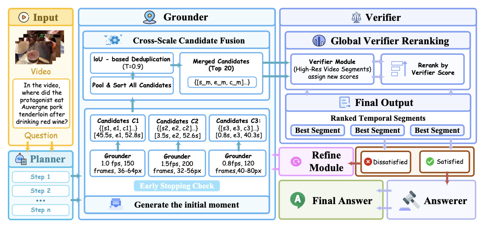

<h2 align="center">ActiveLook: Feedback-Driven Multi-Scale Active Perception for Long Video Reasoning</h2>

<p align="center">
  <a href="https://arxiv.org/"></a>
  <a href="https://github.com/Amordia/ActiveLook"></a>
  
  
</p>

> **TL;DR:** We reformulate long-video temporal grounding as a *feedback-driven active perception process*, adding an iterative self-feedback refinement mechanism on top of a chain-of-LoRA agent to fix low-confidence predictions automatically.

---

## 📌 Overview

**ActiveLook** is a lightweight video reasoning framework built on top of [VideoMind](https://github.com/yeliudev/VideoMind) that addresses two critical limitations in existing long-form video temporal grounding (TG) pipelines:

1. **Fixed single-scale visual input** — existing frameworks use a single fixed frame-sampling rate and resolution, failing to capture fine-grained temporal details of sparse or short-duration events in long videos.
2. **Static one-way inference** — existing pipelines generate candidate segments in a single pass with no closed-loop feedback. Errors from the grounding module propagate silently downstream without correction.

ActiveLook introduces:

- 🔁 **Dual-Signal Feedback Diagnosis** — a module that evaluates candidate segments based on *semantic confidence* and *output uncertainty*, identifying whether failures stem from insufficient temporal sampling or low spatial resolution.
- 🔬 **Active Multi-Scale Refinement Loop** — when low-confidence predictions are detected, the system dynamically triggers resampling at complementary temporal/spatial scales, generating diverse candidate segments strictly on demand.
- 🔀 **Cross-Scale Candidate Fusion & Verifier Reranking** — candidates from all scales are merged, deduplicated by IoU, and globally reranked using the Verifier's discriminative scoring, ensuring the highest-confidence prediction is selected.
- ⚡ **Chain-of-LoRA Efficiency** — all roles (Planner, Grounder, Verifier, Answerer) share a single frozen large multimodal model backbone with lightweight LoRA adapters, keeping inference costs low.

<p align="center">
  
  <br>
  <i>Overview of the ActiveLook framework. The Planner decomposes the question into steps; the Grounder runs three complementary sampling scales (standard / high-temporal / high-spatial) and applies dual-signal early stopping; cross-scale candidates are fused and deduplicated; the Verifier globally reranks them; and the Answerer produces the final answer.</i>
</p>

---

## 🆕 Key Innovation: Multi-Scale Active Grounding

The core innovation is implemented in [`videomind/eval/infer_auto.py`](videomind/eval/infer_auto.py).

### Multi-Scale Grounding Strategy

Instead of one fixed sampling configuration, the Grounder runs at **three complementary scales**:

| Scale | FPS | Max Frames | Resolution |
|---|---|---|---|
| `standard` | 1.0 | 150 | 36–64 × 28² px |
| `high_temporal` | 1.5 | 200 | 32–56 × 28² px |
| `high_spatial` | 0.8 | 120 | 48–80 × 28² px |

- **Standard** serves the baseline; captures the overall temporal structure.
- **High-temporal** uses a higher FPS and more frames, targeting short transient events that would be missed in standard sampling.
- **High-spatial** uses smaller FPS but higher spatial resolution, targeting events that require fine visual discrimination (e.g., subtle action details).

### Dual-Signal Confidence-Based Early Stopping

After each scale, the system computes the **IoU** between the current top-1 prediction and the previous round's prediction, alongside the **confidence difference**:
- If `IoU > 0.95` and `ΔConf < 0.01`, predictions are considered converged and the refinement loop terminates early, saving unnecessary computation.

### Cross-Scale Candidate Fusion

After all scale rounds complete:
1. Top-*K* candidates (default *K* = 10) are collected from each scale.
2. Candidates with `IoU > 0.9` are deduplicated, keeping the higher-confidence one.
3. The merged pool is passed to the **Verifier** for global reranking.

### Verifier-Based Global Reranking

The Verifier scores each merged candidate independently by attending to a padded region-of-interest in the video. Final predictions are sorted by Verifier score. This globally consistent reranking eliminates scale-specific biases and identifies the most semantically accurate segment.

---

## 🏗️ Repository Structure

```
ActiveLook/
├── videomind/
│   ├── constants.py          # Role prompts (Planner, Grounder, Verifier, Answerer)
│   ├── conversation.py       # Conversation utilities
│   ├── dataset/              # Dataset loaders and preprocessors
│   ├── eval/
│   │   ├── infer_auto.py     # ⭐ Core: Multi-scale active grounding inference
│   │   ├── eval_auto.py      # Evaluation metric computation
│   │   ├── infer_qvhighlights.py
│   │   └── eval_qvhighlights.py
│   ├── model/                # Model builder and LoRA architecture
│   ├── train/                # Training routines
│   └── utils/                # I/O, parsing, subtitle loading
├── scripts/
│   ├── evaluation/           # Evaluation shell scripts (2B and 7B)
│   ├── finetune/             # Fine-tuning scripts
│   ├── pretrain/             # Pretraining scripts
│   └── zero*.json            # DeepSpeed ZeRO configs
├── requirements.txt
├── setup.cfg
└── LICENSE
```

---

## 📦 Installation

### Prerequisites
- Python ≥ 3.10
- CUDA ≥ 11.8 (NVIDIA GPU) or Ascend NPU
- PyTorch ≥ 2.0

### Install

```bash
git clone https://github.com/Amordia/ActiveLook.git
cd ActiveLook
pip install -r requirements.txt
```

---

## 🚀 Quick Start

### Model Preparation

Download the pre-trained VideoMind weights:
```bash
mkdir model_zoo
# VideoMind-2B
huggingface-cli download yeliudev/VideoMind-2B --local-dir model_zoo/VideoMind-2B

# VideoMind-7B (optional)
huggingface-cli download yeliudev/VideoMind-7B --local-dir model_zoo/VideoMind-7B
```

### Running Multi-Scale Inference

Use the provided shell script for evaluation:

```bash
export PYTHONPATH="./:$PYTHONPATH"

# Evaluate on a benchmark (e.g., cgbench, rextime, nextgqa, charades_sta)
bash scripts/evaluation/eval_auto_2b.sh <dataset> <split>

# Example: CG-Bench test split
bash scripts/evaluation/eval_auto_2b.sh cgbench test
```

Or run the Python inference script directly:

```bash
python videomind/eval/infer_auto.py \
    --dataset cgbench \
    --split test \
    --pred_path outputs/cgbench_test \
    --model_gnd_path model_zoo/VideoMind-2B \
    --model_ver_path model_zoo/VideoMind-2B \
    --model_pla_path model_zoo/VideoMind-2B \
    --auto_rephrasing \
    --auto_planning
```

Key arguments:

| Argument | Description |
|---|---|
| `--model_gnd_path` | Path to the Grounder model (required) |
| `--model_ver_path` | Path to the Verifier model |
| `--model_pla_path` | Path to the Planner model |
| `--model_ans_path` | Path to the Answerer model |
| `--auto_rephrasing` | Enable planner-based query rephrasing |
| `--auto_planning` | Enable planner to decide whether grounding is needed |
| `--use_subtitle` | Load subtitles if available for answering |
| `--chunk` / `--index` | Enable multi-GPU distributed inference |

### Multi-GPU Inference

The evaluation script automatically shards the dataset across available GPUs:

```bash
export CUDA_VISIBLE_DEVICES=0,1,2,3
bash scripts/evaluation/eval_auto_2b.sh cgbench test
```

---

## 🔮 Evaluation

After inference, compute the metrics:

```bash
python videomind/eval/eval_auto.py outputs/cgbench_test --dataset cgbench
```

---

## 🔧 Training

ActiveLook inherits VideoMind's training pipeline. See `scripts/finetune/` for fine-tuning scripts. Training supports:

- **DeepSpeed ZeRO 2/3** (configs in `scripts/zero*.json`)
- **BF16** mixed precision
- **LoRA** for parameter-efficient training
- **Multi-node** distributed training

---

## 📖 Citation

If you find this work helpful, please cite our paper:

```bibtex
@article{dang2025activelook,
  title={ActiveLook: Feedback-Driven Multi-Scale Active Perception for Long Video Reasoning},
  author={Dang, Jisheng and Chai, Mingxuan and Xu, Yipeng and Wan, Quan and Wang, Bimei and Peng, Hong and Hu, Bin and Tian, Qi and Chua, Tat-Seng},
  journal={IEEE Transactions on Multimedia},
  year={2025}
}
```

We also build upon [VideoMind](https://github.com/yeliudev/VideoMind). Please consider citing the original work:

```bibtex
@article{liu2025videomind,
  title={VideoMind: A Chain-of-LoRA Agent for Long Video Reasoning},
  author={Liu, Ye and Lin, Kevin Qinghong and Chen, Chang Wen and Shou, Mike Zheng},
  journal={arXiv preprint arXiv:2503.13444},
  year={2025}
}
```

---

## 📜 License

This project is released under the [BSD-3-Clause License](LICENSE). Parts of the code are adapted from [VideoMind](https://github.com/yeliudev/VideoMind), which is also released under the BSD-3-Clause License.
